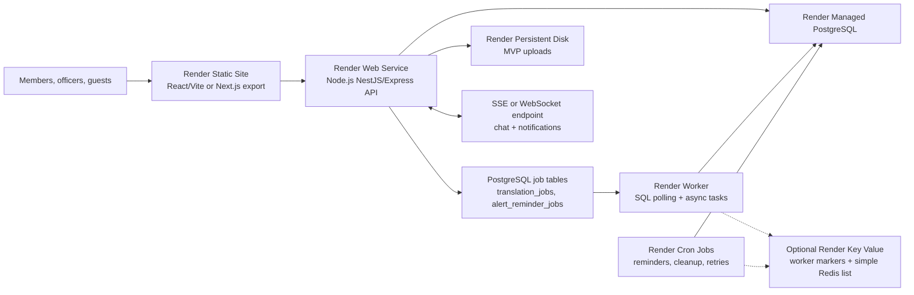

# GuildOps Render Architecture

GuildOps is a Render-only SaaS platform for mobile strategy guild leaders. It lets guilds create public sites and manage recruitment, wars, event attendance, attack alerts, diplomacy, resources, private forums, messaging, public guest chat, automatic translation, multi-guild worlds, and guild merges.

Supabase is intentionally not used.

## 1. Target Architecture



### Render resources

- `guildops-frontend`: Render Static Site for React/Vite. Use a Web Service instead if Next.js SSR is required.
- `guildops-api`: Render Web Service for the public API and real-time HTTP endpoint. It must bind to `0.0.0.0:$PORT`.
- `guildops-postgres`: Render Managed PostgreSQL, using internal connection URL from Render services.
- `guildops-worker`: Render Background Worker that polls Postgres-backed work tables and runs async tasks.
- `guildops-event-reminders`: Render Cron Job every 5 minutes for upcoming event reminders.
- `guildops-diplomacy-maintenance`: Render Cron Job for expired diplomacy/NAP maintenance.
- `guildops-session-cleanup`: Render Cron Job for expired session cleanup.
- MVP uploads: Render persistent disk mounted on API at `/var/data/guildops/uploads`.
- Optional: add Render Key Value later for lightweight worker markers or Redis-list job delegation. The current Blueprint does not provision Key Value by default, and the current worker does not use BullMQ.

## 2. Service Boundaries

### Frontend

- React/Vite SPA by default, hosted as a Render Static Site on the CDN.
- Calls public API URL through `VITE_API_URL`.
- Uses SSE for notification/chat stream by default because it works well behind HTTP infrastructure and auto-reconnects.
- WebSocket can be added for richer bidirectional chat, but SSE + REST is enough for MVP.

### Backend API

Recommended: NestJS if the domain grows quickly; Express/Fastify if you want less framework weight.

Responsibilities:

- Auth, sessions, RBAC/ABAC permissions.
- Tenant/guild/world routing.
- CRUD for guild sites, recruitment, events, attendance, roles, objectives, diplomacy, bank, forum, messages.
- File upload endpoint backed by Render disk.
- SSE or WebSocket real-time gateway.
- SQL job producers for alerts, reminders, translation and notification work.

### Worker

Current queue model: Postgres-backed work tables. The worker polls and claims rows using transactional locks, including `translation_jobs` and `alert_reminder_jobs`.

Optional queue extension: the worker can consume a simple Redis list named by `WORKER_QUEUE_NAME` when `REDIS_QUEUE_URL` is configured. This is a small control-job path for externally enqueued maintenance work, not BullMQ.

Responsibilities:

- Broadcast SOS notifications.
- Fanout reminders to members by role/language.
- Translate messages asynchronously and persist results.
- Process email/web-push jobs.
- Recompute merge duplicate candidates.
- Retry failed external provider calls.

### Cron Jobs

Render Cron expressions are UTC.

- Every 5 minutes: run or delegate event reminders, check late attendance, relaunch pending confirmations.
- Hourly: process presence followups and retry stuck jobs.
- Nightly: cleanup expired sessions, compact audit/history, refresh duplicate detection materialized views.

## 3. PostgreSQL Schema

Use UUID primary keys, `created_at`, `updated_at`, soft deletes only where recovery matters, and strict tenant scoping.

```sql
CREATE EXTENSION IF NOT EXISTS pgcrypto;
CREATE EXTENSION IF NOT EXISTS citext;

CREATE TYPE guild_role_code AS ENUM (
  'member', 'officer', 'diplomat', 'banker', 'recruiter', 'admin', 'owner'
);

CREATE TYPE attendance_status AS ENUM ('pending', 'confirmed', 'maybe', 'absent');
CREATE TYPE alert_status AS ENUM ('active', 'resolved', 'cancelled');
CREATE TYPE relation_type AS ENUM ('ally', 'enemy', 'nap', 'neutral');
CREATE TYPE message_scope AS ENUM ('private', 'guild', 'public_guest', 'forum');
CREATE TYPE resource_type AS ENUM ('food', 'wood', 'stone', 'ore', 'gold', 'gems', 'other');

CREATE TABLE users (
  id uuid PRIMARY KEY DEFAULT gen_random_uuid(),
  email citext NOT NULL UNIQUE,
  password_hash text NOT NULL,
  display_name text NOT NULL,
  preferred_language text NOT NULL DEFAULT 'fr',
  avatar_file_id uuid,
  email_verified_at timestamptz,
  disabled_at timestamptz,
  created_at timestamptz NOT NULL DEFAULT now(),
  updated_at timestamptz NOT NULL DEFAULT now()
);

CREATE TABLE sessions (
  id uuid PRIMARY KEY DEFAULT gen_random_uuid(),
  user_id uuid NOT NULL REFERENCES users(id) ON DELETE CASCADE,
  session_hash text NOT NULL UNIQUE,
  ip inet,
  user_agent text,
  expires_at timestamptz NOT NULL,
  revoked_at timestamptz,
  created_at timestamptz NOT NULL DEFAULT now()
);

CREATE TABLE guilds (
  id uuid PRIMARY KEY DEFAULT gen_random_uuid(),
  owner_user_id uuid NOT NULL REFERENCES users(id),
  name text NOT NULL,
  slug citext NOT NULL UNIQUE,
  primary_game text NOT NULL,
  default_language text NOT NULL DEFAULT 'fr',
  play_style text,
  public_site_enabled boolean NOT NULL DEFAULT false,
  logo_file_id uuid,
  created_at timestamptz NOT NULL DEFAULT now(),
  updated_at timestamptz NOT NULL DEFAULT now()
);

CREATE TABLE worlds (
  id uuid PRIMARY KEY DEFAULT gen_random_uuid(),
  guild_id uuid NOT NULL REFERENCES guilds(id) ON DELETE CASCADE,
  game text NOT NULL,
  server_code text NOT NULL,
  label text,
  timezone text NOT NULL DEFAULT 'UTC',
  UNIQUE (guild_id, game, server_code)
);

CREATE TABLE memberships (
  id uuid PRIMARY KEY DEFAULT gen_random_uuid(),
  guild_id uuid NOT NULL REFERENCES guilds(id) ON DELETE CASCADE,
  world_id uuid REFERENCES worlds(id) ON DELETE SET NULL,
  user_id uuid NOT NULL REFERENCES users(id) ON DELETE CASCADE,
  nickname text NOT NULL,
  power_score bigint,
  language text,
  status text NOT NULL DEFAULT 'active',
  joined_at timestamptz NOT NULL DEFAULT now(),
  UNIQUE (guild_id, user_id)
);

CREATE TABLE roles (
  id uuid PRIMARY KEY DEFAULT gen_random_uuid(),
  guild_id uuid REFERENCES guilds(id) ON DELETE CASCADE,
  code guild_role_code NOT NULL,
  name text NOT NULL,
  rank int NOT NULL DEFAULT 0,
  UNIQUE (guild_id, code)
);

CREATE TABLE permissions (
  key text PRIMARY KEY,
  description text NOT NULL
);

CREATE TABLE role_permissions (
  role_id uuid NOT NULL REFERENCES roles(id) ON DELETE CASCADE,
  permission_key text NOT NULL REFERENCES permissions(key) ON DELETE CASCADE,
  PRIMARY KEY (role_id, permission_key)
);

CREATE TABLE membership_roles (
  membership_id uuid NOT NULL REFERENCES memberships(id) ON DELETE CASCADE,
  role_id uuid NOT NULL REFERENCES roles(id) ON DELETE CASCADE,
  PRIMARY KEY (membership_id, role_id)
);

CREATE TABLE guild_site_pages (
  id uuid PRIMARY KEY DEFAULT gen_random_uuid(),
  guild_id uuid NOT NULL REFERENCES guilds(id) ON DELETE CASCADE,
  slug citext NOT NULL,
  title text NOT NULL,
  content_json jsonb NOT NULL DEFAULT '{}',
  is_public boolean NOT NULL DEFAULT true,
  published_at timestamptz,
  UNIQUE (guild_id, slug)
);

CREATE TABLE recruitment_posts (
  id uuid PRIMARY KEY DEFAULT gen_random_uuid(),
  guild_id uuid NOT NULL REFERENCES guilds(id) ON DELETE CASCADE,
  world_id uuid REFERENCES worlds(id) ON DELETE SET NULL,
  title text NOT NULL,
  requirements_json jsonb NOT NULL DEFAULT '{}',
  status text NOT NULL DEFAULT 'draft',
  created_by uuid NOT NULL REFERENCES users(id),
  published_at timestamptz
);

CREATE TABLE applications (
  id uuid PRIMARY KEY DEFAULT gen_random_uuid(),
  recruitment_post_id uuid NOT NULL REFERENCES recruitment_posts(id) ON DELETE CASCADE,
  applicant_user_id uuid REFERENCES users(id) ON DELETE SET NULL,
  guest_email citext,
  payload_json jsonb NOT NULL DEFAULT '{}',
  status text NOT NULL DEFAULT 'new',
  created_at timestamptz NOT NULL DEFAULT now()
);

CREATE TABLE events (
  id uuid PRIMARY KEY DEFAULT gen_random_uuid(),
  guild_id uuid NOT NULL REFERENCES guilds(id) ON DELETE CASCADE,
  world_id uuid REFERENCES worlds(id) ON DELETE SET NULL,
  title text NOT NULL,
  event_type text NOT NULL,
  starts_at timestamptz NOT NULL,
  ends_at timestamptz,
  target_json jsonb NOT NULL DEFAULT '{}',
  created_by uuid NOT NULL REFERENCES users(id),
  created_at timestamptz NOT NULL DEFAULT now()
);

CREATE TABLE event_attendance (
  event_id uuid NOT NULL REFERENCES events(id) ON DELETE CASCADE,
  membership_id uuid NOT NULL REFERENCES memberships(id) ON DELETE CASCADE,
  status attendance_status NOT NULL DEFAULT 'pending',
  note text,
  updated_at timestamptz NOT NULL DEFAULT now(),
  PRIMARY KEY (event_id, membership_id)
);

CREATE TABLE objectives (
  id uuid PRIMARY KEY DEFAULT gen_random_uuid(),
  guild_id uuid NOT NULL REFERENCES guilds(id) ON DELETE CASCADE,
  membership_id uuid REFERENCES memberships(id) ON DELETE SET NULL,
  event_id uuid REFERENCES events(id) ON DELETE SET NULL,
  title text NOT NULL,
  details text,
  due_at timestamptz,
  completed_at timestamptz
);

CREATE TABLE attack_alerts (
  id uuid PRIMARY KEY DEFAULT gen_random_uuid(),
  guild_id uuid NOT NULL REFERENCES guilds(id) ON DELETE CASCADE,
  world_id uuid REFERENCES worlds(id) ON DELETE SET NULL,
  created_by_membership_id uuid REFERENCES memberships(id) ON DELETE SET NULL,
  target_label text NOT NULL,
  coordinates jsonb NOT NULL DEFAULT '{}',
  attack_type text NOT NULL,
  message text NOT NULL,
  status alert_status NOT NULL DEFAULT 'active',
  resolved_at timestamptz,
  created_at timestamptz NOT NULL DEFAULT now()
);

CREATE TABLE diplomacy_relations (
  id uuid PRIMARY KEY DEFAULT gen_random_uuid(),
  guild_id uuid NOT NULL REFERENCES guilds(id) ON DELETE CASCADE,
  world_id uuid REFERENCES worlds(id) ON DELETE SET NULL,
  tag text NOT NULL,
  name text NOT NULL,
  relation relation_type NOT NULL,
  notes text,
  updated_by uuid REFERENCES users(id),
  updated_at timestamptz NOT NULL DEFAULT now()
);

CREATE TABLE important_coordinates (
  id uuid PRIMARY KEY DEFAULT gen_random_uuid(),
  guild_id uuid NOT NULL REFERENCES guilds(id) ON DELETE CASCADE,
  world_id uuid REFERENCES worlds(id) ON DELETE SET NULL,
  label text NOT NULL,
  x int NOT NULL,
  y int NOT NULL,
  category text NOT NULL,
  visibility text NOT NULL DEFAULT 'members'
);

CREATE TABLE bank_accounts (
  id uuid PRIMARY KEY DEFAULT gen_random_uuid(),
  guild_id uuid NOT NULL REFERENCES guilds(id) ON DELETE CASCADE,
  world_id uuid REFERENCES worlds(id) ON DELETE SET NULL,
  name text NOT NULL DEFAULT 'Banque principale',
  UNIQUE (guild_id, world_id, name)
);

CREATE TABLE bank_balances (
  bank_account_id uuid NOT NULL REFERENCES bank_accounts(id) ON DELETE CASCADE,
  resource resource_type NOT NULL,
  amount numeric(20, 2) NOT NULL DEFAULT 0,
  updated_at timestamptz NOT NULL DEFAULT now(),
  PRIMARY KEY (bank_account_id, resource)
);

CREATE TABLE bank_requests (
  id uuid PRIMARY KEY DEFAULT gen_random_uuid(),
  bank_account_id uuid NOT NULL REFERENCES bank_accounts(id) ON DELETE CASCADE,
  requester_membership_id uuid NOT NULL REFERENCES memberships(id),
  resource resource_type NOT NULL,
  amount numeric(20, 2) NOT NULL,
  reason text,
  status text NOT NULL DEFAULT 'pending',
  decided_by_membership_id uuid REFERENCES memberships(id),
  decided_at timestamptz,
  created_at timestamptz NOT NULL DEFAULT now()
);

CREATE TABLE bank_ledger_entries (
  id uuid PRIMARY KEY DEFAULT gen_random_uuid(),
  bank_account_id uuid NOT NULL REFERENCES bank_accounts(id) ON DELETE CASCADE,
  resource resource_type NOT NULL,
  delta numeric(20, 2) NOT NULL,
  reason text NOT NULL,
  actor_membership_id uuid REFERENCES memberships(id),
  related_request_id uuid REFERENCES bank_requests(id),
  created_at timestamptz NOT NULL DEFAULT now()
);

CREATE TABLE conversations (
  id uuid PRIMARY KEY DEFAULT gen_random_uuid(),
  guild_id uuid REFERENCES guilds(id) ON DELETE CASCADE,
  scope message_scope NOT NULL,
  title text,
  created_at timestamptz NOT NULL DEFAULT now()
);

CREATE TABLE conversation_members (
  conversation_id uuid NOT NULL REFERENCES conversations(id) ON DELETE CASCADE,
  membership_id uuid NOT NULL REFERENCES memberships(id) ON DELETE CASCADE,
  last_read_at timestamptz,
  PRIMARY KEY (conversation_id, membership_id)
);

CREATE TABLE messages (
  id uuid PRIMARY KEY DEFAULT gen_random_uuid(),
  conversation_id uuid NOT NULL REFERENCES conversations(id) ON DELETE CASCADE,
  sender_user_id uuid REFERENCES users(id) ON DELETE SET NULL,
  sender_guest_name text,
  source_language text NOT NULL DEFAULT 'auto',
  body text NOT NULL,
  metadata_json jsonb NOT NULL DEFAULT '{}',
  created_at timestamptz NOT NULL DEFAULT now(),
  deleted_at timestamptz
);

CREATE TABLE translations (
  id uuid PRIMARY KEY DEFAULT gen_random_uuid(),
  source_table text NOT NULL
    CHECK (source_table IN ('private_messages', 'public_chat_messages', 'forum_posts', 'alerts', 'recruitment_posts')),
  source_id uuid NOT NULL,
  source_language varchar(12) NOT NULL DEFAULT 'auto',
  target_language varchar(12) NOT NULL,
  translated_text text NOT NULL,
  provider text NOT NULL,
  provider_request_hash text,
  created_at timestamptz NOT NULL DEFAULT now(),
  UNIQUE (source_table, source_id, target_language)
);

CREATE TABLE translation_jobs (
  id uuid PRIMARY KEY DEFAULT gen_random_uuid(),
  source_table text NOT NULL
    CHECK (source_table IN ('private_messages', 'public_chat_messages', 'forum_posts', 'alerts', 'recruitment_posts')),
  source_id uuid NOT NULL,
  source_language varchar(12) NOT NULL DEFAULT 'auto',
  target_language varchar(12) NOT NULL,
  status text NOT NULL DEFAULT 'queued'
    CHECK (status IN ('queued', 'processing', 'completed', 'failed', 'cancelled')),
  provider text,
  attempts int NOT NULL DEFAULT 0,
  max_attempts int NOT NULL DEFAULT 5,
  locked_at timestamptz,
  next_attempt_at timestamptz NOT NULL DEFAULT now(),
  last_error text,
  created_at timestamptz NOT NULL DEFAULT now(),
  updated_at timestamptz NOT NULL DEFAULT now(),
  completed_at timestamptz,
  UNIQUE (source_table, source_id, target_language)
);

CREATE TABLE forum_categories (
  id uuid PRIMARY KEY DEFAULT gen_random_uuid(),
  guild_id uuid NOT NULL REFERENCES guilds(id) ON DELETE CASCADE,
  name text NOT NULL,
  visibility text NOT NULL DEFAULT 'members'
);

CREATE TABLE forum_threads (
  id uuid PRIMARY KEY DEFAULT gen_random_uuid(),
  category_id uuid NOT NULL REFERENCES forum_categories(id) ON DELETE CASCADE,
  author_membership_id uuid REFERENCES memberships(id),
  title text NOT NULL,
  locked_at timestamptz,
  created_at timestamptz NOT NULL DEFAULT now()
);

CREATE TABLE forum_posts (
  id uuid PRIMARY KEY DEFAULT gen_random_uuid(),
  thread_id uuid NOT NULL REFERENCES forum_threads(id) ON DELETE CASCADE,
  author_membership_id uuid REFERENCES memberships(id),
  body text NOT NULL,
  created_at timestamptz NOT NULL DEFAULT now(),
  deleted_at timestamptz
);

CREATE TABLE files (
  id uuid PRIMARY KEY DEFAULT gen_random_uuid(),
  guild_id uuid REFERENCES guilds(id) ON DELETE CASCADE,
  owner_user_id uuid REFERENCES users(id) ON DELETE SET NULL,
  storage_key text NOT NULL UNIQUE,
  original_name text NOT NULL,
  mime_type text NOT NULL,
  byte_size bigint NOT NULL,
  checksum text,
  created_at timestamptz NOT NULL DEFAULT now()
);

CREATE TABLE merge_jobs (
  id uuid PRIMARY KEY DEFAULT gen_random_uuid(),
  source_guild_id uuid NOT NULL REFERENCES guilds(id),
  target_guild_id uuid NOT NULL REFERENCES guilds(id),
  requested_by uuid NOT NULL REFERENCES users(id),
  status text NOT NULL DEFAULT 'draft',
  created_at timestamptz NOT NULL DEFAULT now(),
  completed_at timestamptz
);

CREATE TABLE merge_duplicate_candidates (
  id uuid PRIMARY KEY DEFAULT gen_random_uuid(),
  merge_job_id uuid NOT NULL REFERENCES merge_jobs(id) ON DELETE CASCADE,
  source_membership_id uuid REFERENCES memberships(id),
  target_membership_id uuid REFERENCES memberships(id),
  confidence numeric(4, 3) NOT NULL,
  reasons_json jsonb NOT NULL DEFAULT '[]',
  decision text NOT NULL DEFAULT 'pending'
);

CREATE TABLE notification_deliveries (
  id uuid PRIMARY KEY DEFAULT gen_random_uuid(),
  user_id uuid NOT NULL REFERENCES users(id) ON DELETE CASCADE,
  guild_id uuid REFERENCES guilds(id) ON DELETE CASCADE,
  type text NOT NULL,
  channel text NOT NULL,
  payload_json jsonb NOT NULL DEFAULT '{}',
  status text NOT NULL DEFAULT 'queued',
  attempts int NOT NULL DEFAULT 0,
  next_attempt_at timestamptz,
  created_at timestamptz NOT NULL DEFAULT now()
);

CREATE TABLE audit_logs (
  id uuid PRIMARY KEY DEFAULT gen_random_uuid(),
  guild_id uuid REFERENCES guilds(id) ON DELETE CASCADE,
  actor_user_id uuid REFERENCES users(id) ON DELETE SET NULL,
  action text NOT NULL,
  target_type text,
  target_id uuid,
  metadata_json jsonb NOT NULL DEFAULT '{}',
  created_at timestamptz NOT NULL DEFAULT now()
);

CREATE INDEX idx_memberships_guild ON memberships(guild_id);
CREATE INDEX idx_events_guild_starts ON events(guild_id, starts_at);
CREATE INDEX idx_messages_conversation_created ON messages(conversation_id, created_at);
CREATE INDEX idx_attack_alerts_guild_status ON attack_alerts(guild_id, status, created_at DESC);
CREATE INDEX idx_bank_requests_status ON bank_requests(bank_account_id, status, created_at DESC);
CREATE INDEX idx_notifications_next_attempt ON notification_deliveries(status, next_attempt_at);
```

## 4. Permission Model

GuildOps should use two checks:

1. RBAC: user has one or more guild roles.
2. ABAC: action is scoped to a guild/world/resource and may depend on ownership, rank, or membership.

### Permission keys

- `guild.site.read`
- `guild.site.manage`
- `recruitment.read`
- `recruitment.manage`
- `members.read`
- `members.manage`
- `roles.manage`
- `war.read`
- `war.manage`
- `attendance.write.self`
- `attendance.write.any`
- `objectives.manage`
- `sos.create`
- `sos.broadcast`
- `sos.resolve`
- `diplomacy.read`
- `diplomacy.manage`
- `bank.read`
- `bank.request`
- `bank.approve`
- `bank.manage`
- `forum.read`
- `forum.write`
- `forum.moderate`
- `messages.read`
- `messages.write`
- `messages.moderate`
- `chat.public.write`
- `translation.manage`
- `guild.merge`
- `audit.read`
- `admin.manage`

### Default role mapping

| Role | Main permissions |
| --- | --- |
| `member` | attendance self, chat, forum read/write, bank request, messages |
| `officer` | war management, objectives, attendance any, SOS create/resolve |
| `diplomat` | diplomacy manage, coordinates, NAP notes |
| `banker` | bank approve/manage, ledger, resource history |
| `recruiter` | recruitment manage, applications, public site recruitment sections |
| `admin` | members, roles, site, audit, merge |
| `owner` | all permissions, billing/export/destructive actions |

Implementation rule: never trust client-visible role names. The API resolves permissions from `membership_roles -> role_permissions`.

## 5. API Routes

Prefix: `/api/v1`.

### Auth and account

- `POST /auth/register`
- `POST /auth/login`
- `POST /auth/logout`
- `POST /auth/refresh-session`
- `POST /auth/verify-email`
- `POST /auth/password/forgot`
- `POST /auth/password/reset`
- `GET /me`
- `PATCH /me`

### Guilds, worlds, public site

- `POST /guilds`
- `GET /guilds`
- `GET /guilds/:guildId`
- `PATCH /guilds/:guildId`
- `POST /guilds/:guildId/worlds`
- `GET /guilds/:guildId/worlds`
- `GET /public/guilds/:slug`
- `PUT /guilds/:guildId/site/pages/:slug`
- `POST /guilds/:guildId/site/publish`

### Recruitment and directory

- `GET /directory/guilds?game=&server=&language=&style=`
- `POST /guilds/:guildId/recruitment/posts`
- `PATCH /guilds/:guildId/recruitment/posts/:postId`
- `POST /recruitment/posts/:postId/applications`
- `GET /guilds/:guildId/applications`
- `PATCH /guilds/:guildId/applications/:applicationId`

### Wars, events, attendance

- `POST /guilds/:guildId/events`
- `GET /guilds/:guildId/events?from=&to=&worldId=`
- `PATCH /guilds/:guildId/events/:eventId`
- `PUT /guilds/:guildId/events/:eventId/attendance/me`
- `PUT /guilds/:guildId/events/:eventId/attendance/:membershipId`
- `POST /guilds/:guildId/objectives`
- `PATCH /guilds/:guildId/objectives/:objectiveId`

### SOS alerts

- `POST /guilds/:guildId/alerts/attack`
- `GET /guilds/:guildId/alerts/attack?status=active`
- `PATCH /guilds/:guildId/alerts/attack/:alertId/resolve`
- `POST /guilds/:guildId/alerts/attack/:alertId/broadcast`

### Diplomacy

- `GET /guilds/:guildId/diplomacy/relations`
- `POST /guilds/:guildId/diplomacy/relations`
- `PATCH /guilds/:guildId/diplomacy/relations/:relationId`
- `DELETE /guilds/:guildId/diplomacy/relations/:relationId`
- `GET /guilds/:guildId/coordinates`
- `POST /guilds/:guildId/coordinates`

### Bank

- `GET /guilds/:guildId/bank`
- `POST /guilds/:guildId/bank/requests`
- `PATCH /guilds/:guildId/bank/requests/:requestId/approve`
- `PATCH /guilds/:guildId/bank/requests/:requestId/reject`
- `POST /guilds/:guildId/bank/ledger`
- `GET /guilds/:guildId/bank/history`
- `POST /guilds/:guildId/bank/commands`

`POST /bank/commands` accepts `{ command: "!banque", context }` and returns a formatted balance snapshot.

### Messaging, chat, forum

- `GET /guilds/:guildId/conversations`
- `POST /guilds/:guildId/conversations`
- `GET /conversations/:conversationId/messages`
- `POST /conversations/:conversationId/messages`
- `GET /public/guilds/:slug/chat`
- `POST /public/guilds/:slug/chat/messages`
- `GET /guilds/:guildId/forum/categories`
- `POST /guilds/:guildId/forum/threads`
- `GET /forum/threads/:threadId/posts`
- `POST /forum/threads/:threadId/posts`

### Translation

- `POST /messages/:messageId/translations`
- `GET /messages/:messageId/translations/:language`
- `POST /guilds/:guildId/translation/preferences`

### Members, permissions, merge

- `GET /guilds/:guildId/members`
- `PATCH /guilds/:guildId/members/:membershipId`
- `PUT /guilds/:guildId/members/:membershipId/roles`
- `GET /guilds/:guildId/permissions`
- `PUT /guilds/:guildId/roles/:roleId/permissions`
- `POST /guilds/:guildId/merge-jobs`
- `GET /guilds/:guildId/merge-jobs/:mergeJobId/candidates`
- `PATCH /guilds/:guildId/merge-jobs/:mergeJobId/candidates/:candidateId`
- `POST /guilds/:guildId/merge-jobs/:mergeJobId/commit`

### Realtime

- `GET /realtime/sse?guildId=...`
- Optional WebSocket: `GET /realtime/ws`

SSE events:

- `chat.message.created`
- `message.translation.ready`
- `alert.attack.created`
- `alert.attack.resolved`
- `event.attendance.updated`
- `bank.request.created`
- `notification.created`

## 6. Alert System

### SOS flow

1. Officer/member with `sos.create` posts an alert.
2. API writes `attack_alerts`.
3. API publishes a realtime event to online guild members through SSE/WebSocket.
4. API inserts reminder rows in `alert_reminder_jobs`.
5. Worker polls due reminder rows, skips acknowledged or expired alerts, and claims work with row locks.
6. Worker writes in-app private messages and emits/logs reminder payloads. Email/web push can be added behind the same worker path.
7. Cron or the worker can retry stuck deliveries and escalate alerts that remain active.

### Optional Key Value keys

The current default deployment does not require Key Value. If `REDIS_CACHE_URL` or `REDIS_QUEUE_URL` is configured later, the worker uses it only for lightweight auxiliary data:

- `guildops:jobs:default`: simple Redis list for optional control jobs consumed by the long-running worker.
- `guildops:worker:last-*`: recent worker/cron execution markers.
- `guildops:notifications:recent`: capped recent notification payload list.

Presence, rate limits, active-alert caches, and BullMQ queue keys are not part of the current implementation.

## 7. Translation System

### Data model

- Store the original message once in `messages`.
- Store one row per target language in `translations`.
- Store pending async work in `translation_jobs`.
- Treat Postgres as the persistent translation cache for the MVP.

### Flow

1. Sender posts a message.
2. API stores message and emits source text immediately.
3. API detects target languages from active recipients and inserts or refreshes `translation_jobs` rows.
4. Worker polls `translation_jobs`, claims the next due row with `FOR UPDATE SKIP LOCKED`, then checks Postgres for existing translations.
5. Worker calls configured translation adapter.
6. Worker stores translation and emits `message.translation.ready`.
7. Client displays the translation matching each user's preferred language.

### Provider strategy

- MVP: pluggable provider adapter behind `TRANSLATION_PROVIDER` and `TRANSLATION_API_KEY`.
- Strict Render-only evolution: deploy a private translation service container on Render and call it from API/worker on the private network.
- Always keep provider output in Postgres to control cost and latency. A Key Value hot cache can be added later, but it is not required by the current code.

## 8. Upload Storage

MVP:

- Render persistent disk mounted on `guildops-api`.
- API stores files under `/var/data/guildops/uploads/{guildId}/{fileId}`.
- Metadata is stored in `files`.
- Serve private files through authenticated API routes.
- Generate thumbnails in worker.

Tradeoff:

- A web service with persistent disk is single-instance and loses standard zero-downtime deployment behavior.

Evolution:

- Add object storage later: S3-compatible bucket, Cloudflare R2, Backblaze B2, or a dedicated storage service.
- Keep `files.storage_key` abstract so migration does not affect app tables.

## 9. Render Deployment Strategy

1. Use a Git-backed Blueprint with `render.yaml`.
2. Keep all resources in the same region, preferably closest to users. Current proposal uses `frankfurt`.
3. Frontend is a Static Site with SPA rewrite to `/index.html`.
4. API is a Web Service with `/healthz` and `preDeployCommand` for migrations.
5. API must listen on `0.0.0.0` and `process.env.PORT`.
6. Postgres uses the internal URL via `fromDatabase`.
7. Key Value is optional. If added later, use internal URLs via `fromService`, `noeviction` for queue-like data, and `allkeys-lru` for disposable cache data.
8. Workers handle SIGTERM and stop taking new jobs before shutdown.
9. Cron schedules are UTC.
10. Secrets use `generateValue` or `sync: false`; never commit provider keys.

### Post-Deployment Runbook

1. Wait for Render to mark `guildops-api` healthy via `/healthz`. This is a liveness check only and intentionally does not require PostgreSQL.
2. Verify database readiness separately with `GET https://guildops-api.onrender.com/api/v1/readyz`.
3. Treat any non-2xx response from `/api/v1/readyz` as a failed post-deployment check, even if Render shows the service as healthy.

## 10. Project Structure

```text
GuildOps/
  render.yaml
  package.json
  package-lock.json
  apps/
    frontend/
      package.json
      vite.config.ts
      src/
        app/
        components/
        features/
          guild-site/
          recruitment/
          wars/
          attendance/
          alerts/
          diplomacy/
          bank/
          forum/
          messaging/
          realtime/
        lib/
          api-client.ts
          auth.ts
          permissions.ts
      public/
    api/
      package.json
      src/
        main.ts
        app.module.ts
        config/
        db/
          migrations/
          schema.sql
          pool.ts
        modules/
          auth/
          users/
          guilds/
          worlds/
          recruitment/
          events/
          attendance/
          alerts/
          diplomacy/
          bank/
          forum/
          messaging/
          translation/
          files/
          permissions/
          merge/
          realtime/
        queues/
          producer.ts
        common/
          guards/
          errors/
          audit/
      test/
    worker/
      package.json
      src/
        worker.ts
        queues/
          sos.queue.ts
          notifications.queue.ts
          translations.queue.ts
          merge.queue.ts
        jobs/
          send-sos.ts
          send-notification.ts
          translate-message.ts
          detect-duplicates.ts
        cron/
          events.ts
          maintenance.ts
        db/
        config/
    shared/
      package.json
      src/
        types/
        permissions/
        validation/
        realtime-events/
  packages/
    eslint-config/
    tsconfig/
  docs/
    ARCHITECTURE_RENDER.md
```

## 11. MVP Build Order

1. Auth, sessions, guilds, memberships, roles.
2. Public guild site + recruitment + directory search.
3. Events and attendance.
4. SOS alerts + SSE notifications.
5. Bank and `!banque`.
6. Chat/messages + translation queue.
7. Diplomacy and coordinates.
8. Forum.
9. Multi-world/guild switching.
10. Merge duplicate detection.

## Sources

- Render Blueprint YAML reference: https://render.com/docs/blueprint-spec
- Render infrastructure as code: https://render.com/docs/infrastructure-as-code
- Render Static Sites and SPA rewrites: https://render.com/docs/static-sites
- Render Static Site rewrites: https://render.com/docs/redirects-rewrites
- Render Web Services and port binding: https://render.com/docs/web-services
- Render health checks: https://render.com/docs/health-checks
- Render Managed PostgreSQL connection patterns: https://render.com/docs/postgresql-creating-connecting
- Render Key Value: https://render.com/docs/key-value
- Render Cron Jobs: https://render.com/docs/cronjobs
