# Audit mobile connecte - GuildSpace

Date : 11 juillet 2026  
Viewport audite : mobile 390 x 844  
Compte test : codex.audit.1783789519178@example.com  
Guilde test : Audit Mobile 05774, tag AUD, royaume S999  
Perimetre : creation de guilde, espace prive, modules, compte, messages, absences, boutique, admin, parametres.

## Verdict

L'experience connectee est globalement fonctionnelle sur mobile : la creation de compte, la validation email locale, la creation de guilde et l'acces aux modules prives fonctionnent. Le plus gros probleme n'est pas un blocage technique, mais une surcharge mobile : header, carte guilde, onglets hauts, heros de section, contenu et barre de navigation basse occupent trop d'espace vertical et se concurrencent.

Sante generale : correcte mais dense. Aucun debordement horizontal n'a ete detecte sur les routes privees inspectees, mais plusieurs ecrans ont des cibles tactiles trop petites et une hierarchie visuelle trop bruyante.

## Etapes auditees

1. Onboarding avant creation de guilde - Sante : moyenne. Le formulaire est clair, mais long et vite serre sur mobile.
2. Onboarding rempli avant soumission - Sante : a risque. La capture montre une mise en page/crop mobile anormale une fois le formulaire rempli et scrolle vers l'action.
3. Apres creation de guilde / entree dans l'app - Sante : correcte. L'acces est debloque et le contexte de guilde est visible.
4. Site builder / accueil prive - Sante : correcte mais dense. Bonne continuite visuelle, mais trop de navigation simultanee.
5. Centre modules - Sante : moyenne. Le hub est comprehensible, mais les cartes et statuts sont tres compacts.
6. Compte membre - Sante : moyenne. Bon etat de session, mais libelles redondants et hero trop present.
7. Messagerie - Sante : moyenne a risque. Fonction visible, mais forte densite et nombreuses petites cibles.
8. Absences - Sante : correcte. Les compteurs sont lisibles, mais l'ecran manque d'action primaire evidente en premiere vue.
9. Boutique - Sante : moyenne. L'offre est claire, mais le hero et le texte marketing repoussent les actions.
10. Administration - Sante : moyenne. Les indicateurs sont utiles, mais la priorisation mobile reste faible.
11. Parametres multi-guildes - Sante : moyenne. L'information de contexte est bonne, mais les controles sont serres.

## Captures

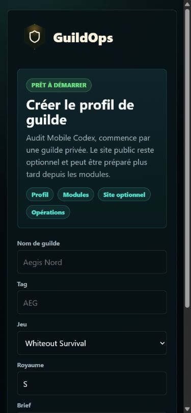
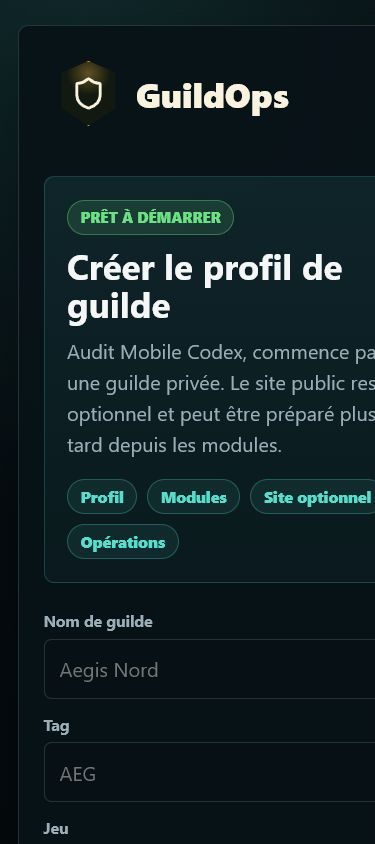
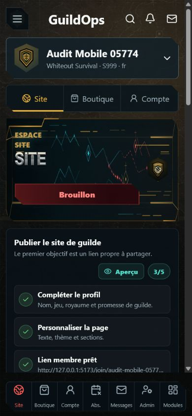
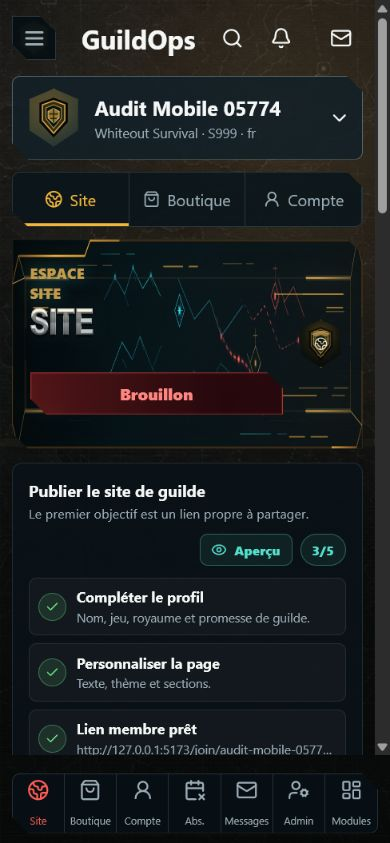
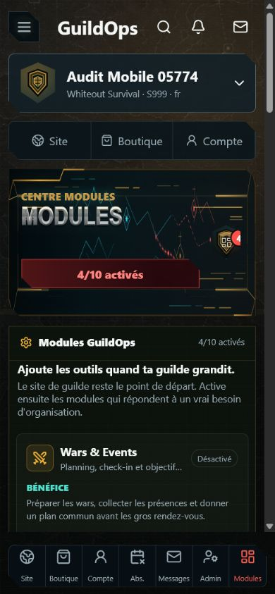
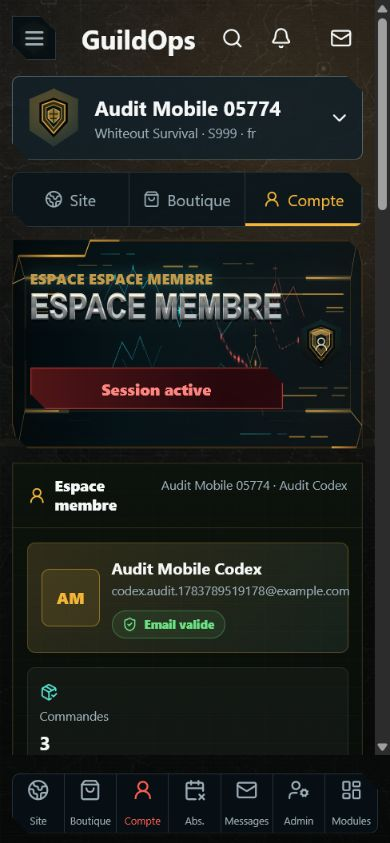
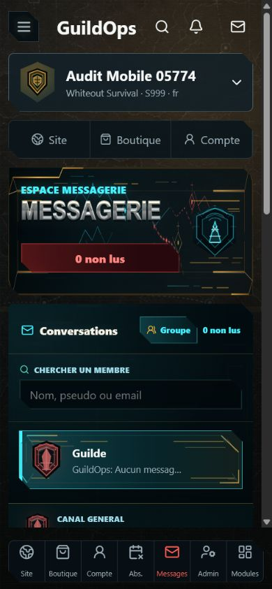
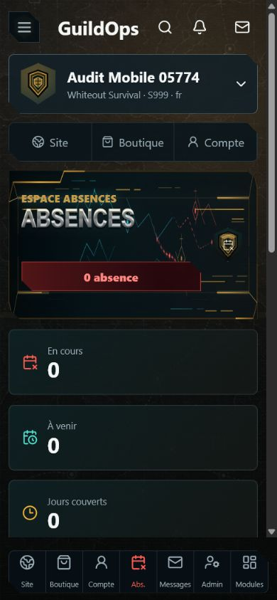
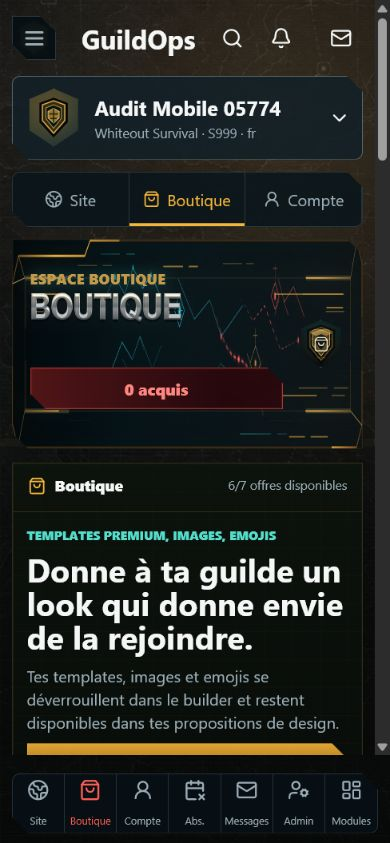
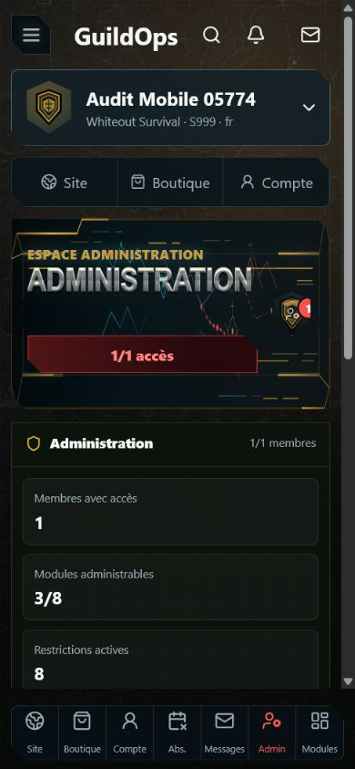
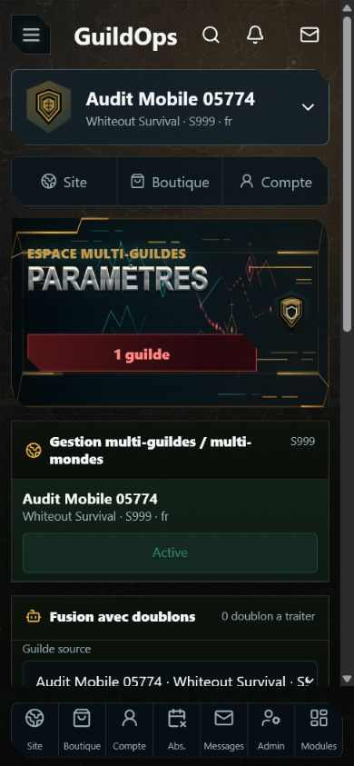

## Points forts

- Le flux compte test -> validation email -> onboarding -> creation de guilde -> app privee est complet et utilisable.
- La selection de guilde reste visible partout, ce qui rassure sur le contexte courant.
- Les principaux espaces ont des etats vides ou des compteurs : messages non lus, absences, offres disponibles, acces admin.
- Les routes privees inspectees ne presentent pas de debordement horizontal mesure.
- La barre basse donne un acces rapide aux sections principales.

## Risques UX prioritaires

1. Onboarding rempli instable sur mobile  
   Evidence : capture 02. Le contenu parait decale/coupe horizontalement apres remplissage et scroll. C'est le risque le plus important, car il touche le premier moment ou l'utilisateur cree sa guilde.

2. Trop de navigation simultanee  
   Evidence : captures 03 a 11. Le mobile affiche souvent header global, carte guilde, onglets haut, grand hero de section et bottom nav. Cela consomme la premiere vue avant que le contenu utile apparaisse.

3. Barre de navigation basse trop dense  
   Evidence : captures 03 a 11. Sept destinations dans une largeur de 390 px creent des libelles courts, des icones proches et des zones tactiles fragiles.

4. Trop de petites cibles tactiles  
   Evidence : metriques capturees : Modules 6, Messages 11, Boutique 12, Parametres 7 petites cibles potentielles. Les icones du header, filtres et elements de navigation doivent etre verifies contre une cible minimale proche de 44 x 44 px.

5. Redondance des titres et lecture confuse  
   Evidence : capture 06 et textes detectes. Exemple : "ESPACE ESPACE MEMBRE" puis "ESPACE MEMBRE". Le motif "ESPACE + titre" se repete sur presque toutes les pages.

6. Heros de section trop volumineux pour des vues utilitaires  
   Evidence : captures 06 a 11. Les grands visuels donnent de l'identite, mais repoussent les donnees et actions sur des ecrans de gestion.

7. Actions primaires parfois absentes de la premiere vue  
   Evidence : Absences, Messages, Admin, Parametres. On comprend l'etat, mais l'action suivante n'est pas toujours visible immediatement.

8. Etat vide encore trop descriptif, pas assez actionnable  
   Evidence : Messages, Absences, Boutique. Les compteurs sont bons, mais il manque parfois une action claire ou un raccourci direct.

## Risques accessibilite visibles

- Cibles tactiles : plusieurs controles semblent inferieurs ou proches du minimum mobile confortable.
- Contraste : le fond texture et les bordures decoratives peuvent reduire la lisibilite des petits libelles gris.
- Ordre de lecture : les titres dupliques et badges decoratifs peuvent rendre la lecture assistive plus verbeuse.
- Navigation au clavier et focus : non verifie depuis les captures seules.
- Etats de formulaire et erreurs : le flux a ete valide, mais les erreurs de saisie n'ont pas ete auditees dans cette passe.

## Recommandations

1. Stabiliser l'onboarding mobile en priorite : largeur, scroll, CTA, validation, et absence de crop horizontal.
2. Creer un mode "mobile compact" pour les pages privees : header reduit, carte guilde compressible, hero masque ou compact apres l'entree.
3. Repenser la bottom nav : 4 ou 5 items prioritaires + menu "Plus", ou libelles masques sauf actif.
4. Agrandir les zones tactiles et ajouter des espacements constants autour des icones.
5. Nettoyer les titres : un seul titre par page, sans duplication "ESPACE ESPACE".
6. Mettre une action principale visible dans chaque ecran vide : envoyer un message, declarer une absence, ajouter une offre, inviter un membre, configurer une guilde.
7. Tester les contrastes et le focus clavier avec un outil dedie apres correction visuelle.

## Limites de preuve

Cet audit s'appuie sur les captures mobiles de cette session et sur les mesures DOM collectees pendant cette session. Il ne prouve pas la conformite WCAG complete, ne couvre pas tous les etats d'erreur, ne teste pas les lecteurs d'ecran, et ne mesure pas les performances reelles sur telephone physique.
