# Audit mobile de validation - 11 juillet 2026

Viewport audite : `390 x 844`.

Donnees de test : guilde publique `Aegis Nord`, langue `FR`, route publique `/g/aegis-nord`.
La route `/app` a ete verifiee avec une session API simulee pour stabiliser l'audit mobile connecte.

## Verdict

Validation mobile globalement acceptee apres micro-corrections des dernieres zones tactiles detectees pendant l'audit.

| Critere | Resultat |
| --- | --- |
| Overflow horizontal | OK, `0/17` capture |
| Controle important sous `44 px` | OK, `0` detection restante |
| `Devenir membre` sans impasse | OK, redirection vers `/join/aegis-nord` exploitable |
| Erreur + chargement simultanes | OK, `0` cas detecte |
| Routes publiques/privees separees | OK, `/app` demande auth sans session, `/g/aegis-nord` reste public |
| `/app` connecte | OK avec session de test simulee |

Resultats machine : [data/mobile-validation-results.json](data/mobile-validation-results.json).

## Etapes auditees

1. Accueil landing : sain. Aucun overflow, CTA empiles proprement, menu mobile accessible.
2. Accueil landing + menu : sain. Le menu ouvre des cibles larges et lisibles.
3. Galerie + resultats : sain. La carte montre explicitement `Voir la guilde`, sans debordement.
4. Galerie + selecteur langue : sain. `Francais (FR)` est immediatement visible, les autres langues restent repliees.
5. Site public accueil : sain. Les CTA principaux restent lisibles et `Devenir membre` est visible.
6. Site public equipe : sain. Filtres et cartes restent dans le viewport mobile.
7. Site public forum : sain. Les actions `Retour accueil` et `Devenir membre` sont claires.
8. Espace membre public : sain. L'etat verrouille explique le blocage et propose `Devenir membre`.
9. Devenir membre : sain. La route n'est pas une impasse et propose connexion, inscription et retour site.
10. Connexion : sain. Erreurs champs vides et API claires, sans chargement simultane.
11. Inscription : sain. Exigence `10 caracteres minimum` visible avant erreur, message court coherent.
12. `/app` connecte simule : sain apres correction des dernieres zones tactiles du builder.

## Captures avant

### 01 - Landing
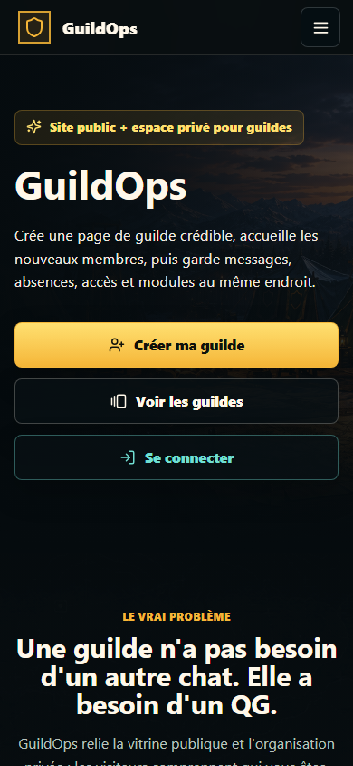

### 02 - Galerie resultats
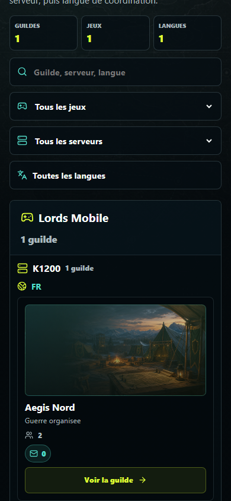

### 03 - Site public accueil
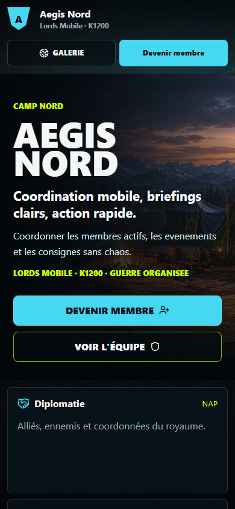

### 04 - Equipe
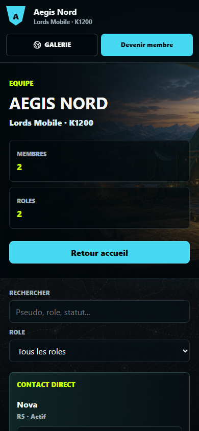

### 05 - Forum
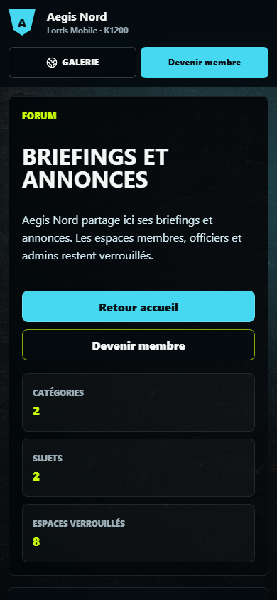

### 06 - Espace membre public
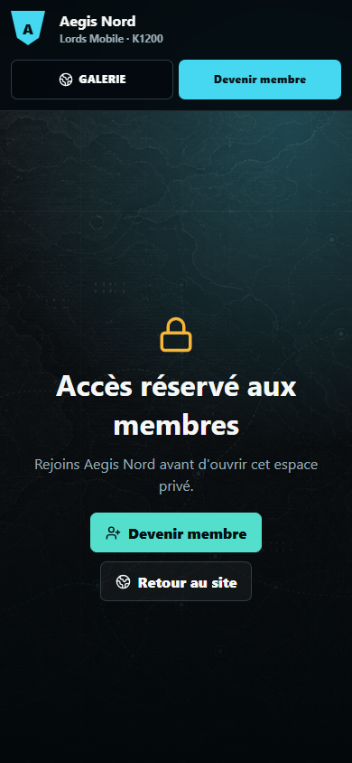

### 07 - Devenir membre
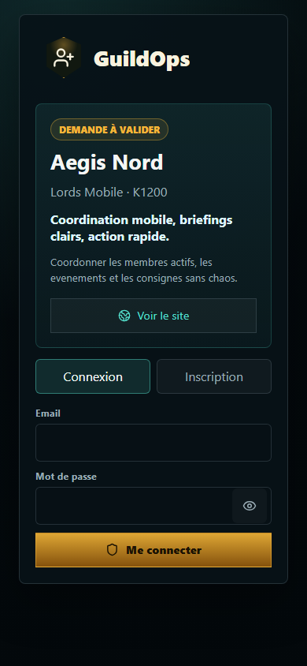

### 08 - Connexion
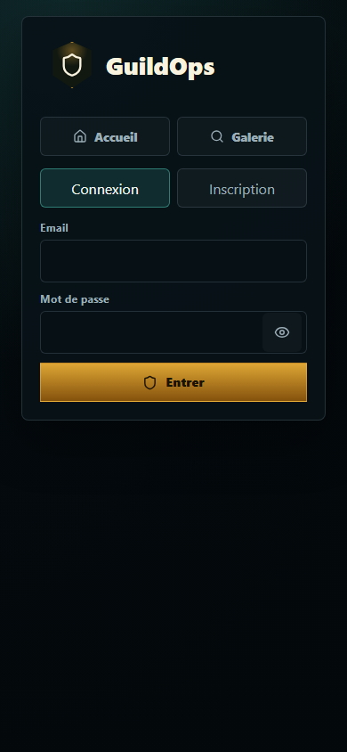

### 09 - Inscription
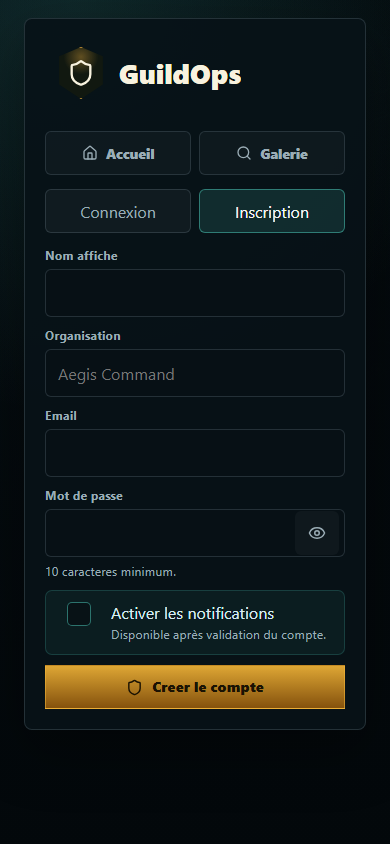

### 10 - App connecte simule
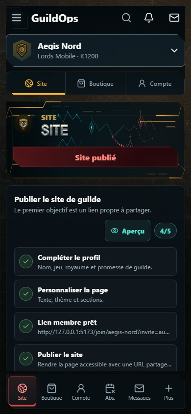

## Captures apres interaction

### 01 - Menu landing ouvert
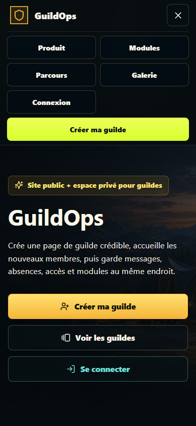

### 02 - Selecteur langue ouvert
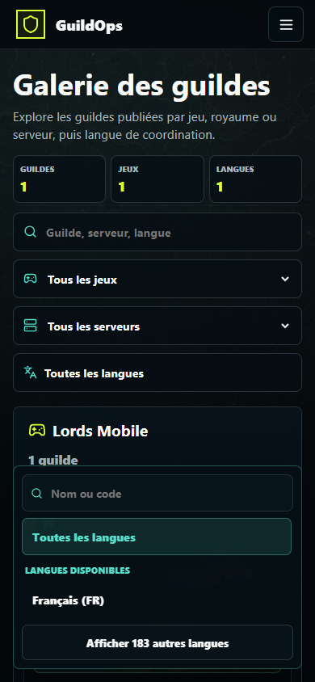

### 03 - Recherche langue `en`
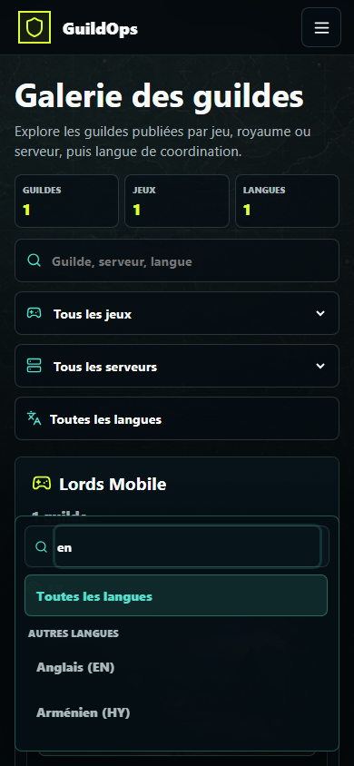

### 04 - Clic Devenir membre

### 05 - Connexion, champs vides
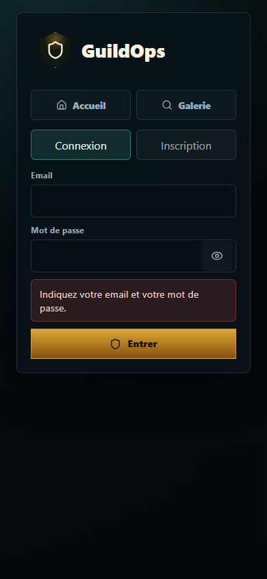

### 06 - Connexion, erreur API
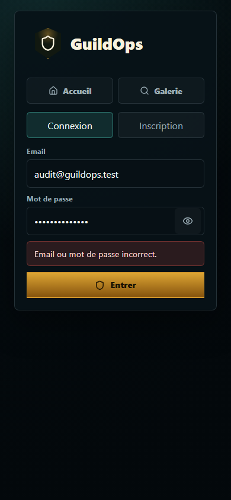

### 07 - Inscription, mot de passe court
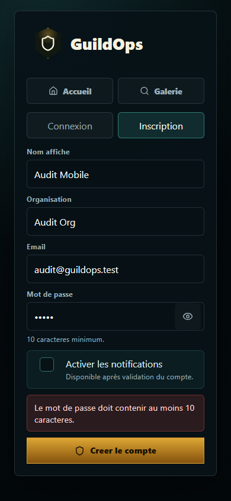

## Corrections appliquees pendant l'audit

- Landing : le bouton decoratif `Nouveau message` de la preview passe a une hauteur minimale de `44 px`.
- Builder `/app` : les icones d'aide focusables, actions de publication et tags rapides passent a `44 px` minimum.

## Limites

- Audit visuel et DOM automatise, pas une certification WCAG complete.
- Les reponses API ont ete simulees pour stabiliser les routes publiques, auth et `/app`.
- La session `/app` valide le layout connecte, pas un cookie reel ni un backend de production.
